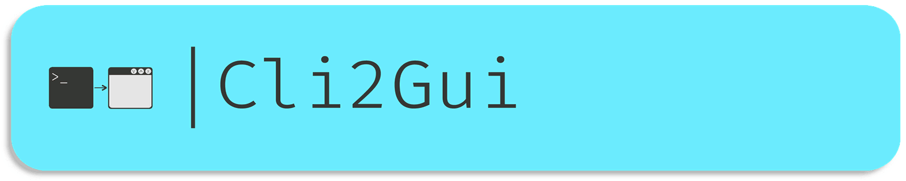
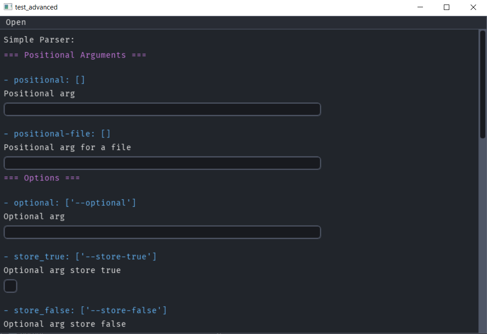
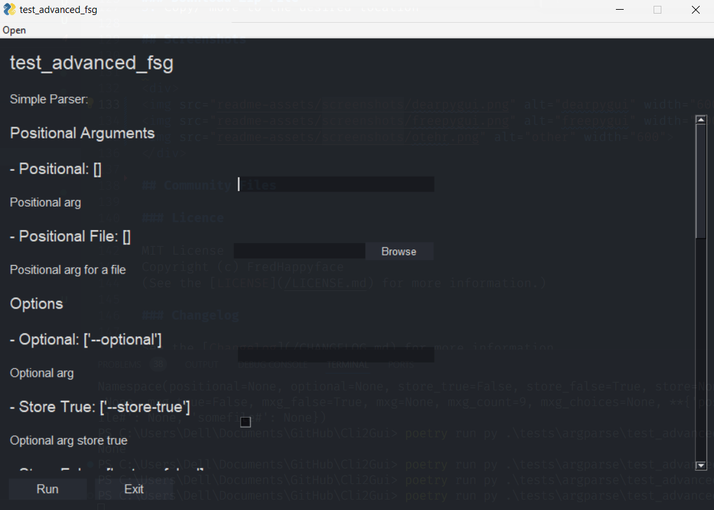

[](../../)
[](../../issues)
[](/LICENSE.md)
[](../../commits/master)
[](../../commits/master)
[](https://pypistats.org/packages/cli2gui)
[](https://pepy.tech/project/cli2gui)
[](https://pypi.org/project/cli2gui)

<!-- omit in toc -->
# Cli2Gui



**Project Description:**

`Cli2Gui` enables you to convert command-line interface (CLI) applications into graphical user
interfaces (GUIs) with minimal effort. Designed to accommodate a wide variety of use cases,
this library allows developers to maintain a CLI while seamlessly enabling a GUI option for
popular Python parsers like `argparse`, `docopt` with GUI frameworks such as `freesimplegui`,
`dearpygui`, and more. By using `Cli2Gui`, developers can extend the accessibility of their
applications, catering to both command-line users and those who prefer interactive graphical tools.

With a decorator-based approach, `Cli2Gui` allows you to keep your CLI logic intact while adding
GUI support as needed. Customization options such as theming, custom icons, and program descriptions
make it easy to enhance the user experience. Whether you are working on small scripts or complex
tools, `Cli2Gui` provides a flexible and user-friendly way to bridge the gap between command-line
and graphical interfaces, offering convenience for both developers and end-users.

- [Screenshots](#screenshots)
- [Documentation](#documentation)
- [Install With PIP](#install-with-pip)
- [Language information](#language-information)
	- [Built for](#built-for)
- [Building](#building)
- [Download Project](#download-project)
	- [Clone](#clone)
		- [Using The Command Line](#using-the-command-line)
		- [Using GitHub Desktop](#using-github-desktop)
	- [Download Zip File](#download-zip-file)
- [Community Files](#community-files)
	- [Licence](#licence)
	- [Changelog](#changelog)
	- [Code of Conduct](#code-of-conduct)
	- [Contributing](#contributing)
	- [Security](#security)
	- [Support](#support)

## Screenshots

<div>


</div>


## Documentation

A high-level overview of how the documentation is organized organized will help you know
where to look for certain things:

- [Tutorials](/documentation/tutorials) take you by the hand through a series of steps to get
  started using the software. Start here if you’re new.
- The [Technical Reference](/documentation/reference) documents APIs and other aspects of the
  machinery. This documentation describes how to use the classes and functions at a lower level
  and assume that you have a good high-level understanding of the software.
<!--
- The [Help](/documentation/help) guide provides a starting point and outlines common issues that you
  may have.
-->

## Install With PIP

```python
pip install cli2gui
```

Head to https://pypi.org/project/cli2gui/ for more info

## Language information

### Built for

This program has been written for Python versions 3.8 - 3.11 and has been tested with both 3.8 and
3.11

## Building

This project uses https://github.com/FHPythonUtils/FHMake to automate most of the building. This
command generates the documentation, updates the requirements.txt and builds the library artefacts

Note the functionality provided by fhmake can be approximated by the following

```sh
handsdown  --cleanup -o documentation/reference
poetry export -f requirements.txt --output requirements.txt
poetry export -f requirements.txt --with dev --output requirements_optional.txt
poetry build
```

`fhmake audit` can be run to perform additional checks

## Download Project

### Clone

#### Using The Command Line

1. Press the Clone or download button in the top right
2. Copy the URL (link)
3. Open the command line and change directory to where you wish to
clone to
4. Type 'git clone' followed by URL in step 2

	```bash
	git clone https://github.com/FHPythonUtils/Cli2Gui
	```

More information can be found at
https://help.github.com/en/articles/cloning-a-repository

#### Using GitHub Desktop

1. Press the Clone or download button in the top right
2. Click open in desktop
3. Choose the path for where you want and click Clone

More information can be found at
https://help.github.com/en/desktop/contributing-to-projects/cloning-a-repository-from-github-to-github-desktop

### Download Zip File

1. Download this GitHub repository
2. Extract the zip archive
3. Copy/ move to the desired location

## Community Files

### Licence

MIT License
Copyright (c) FredHappyface
(See the [LICENSE](/LICENSE.md) for more information.)

### Changelog

See the [Changelog](/CHANGELOG.md) for more information.

### Code of Conduct

Online communities include people from many backgrounds. The *Project*
contributors are committed to providing a friendly, safe and welcoming
environment for all. Please see the
[Code of Conduct](https://github.com/FHPythonUtils/.github/blob/master/CODE_OF_CONDUCT.md)
 for more information.

### Contributing

Contributions are welcome, please see the
[Contributing Guidelines](https://github.com/FHPythonUtils/.github/blob/master/CONTRIBUTING.md)
for more information.

### Security

Thank you for improving the security of the project, please see the
[Security Policy](https://github.com/FHPythonUtils/.github/blob/master/SECURITY.md)
for more information.

### Support

Thank you for using this project, I hope it is of use to you. Please be aware that
those involved with the project often do so for fun along with other commitments
(such as work, family, etc). Please see the
[Support Policy](https://github.com/FHPythonUtils/.github/blob/master/SUPPORT.md)
for more information.
