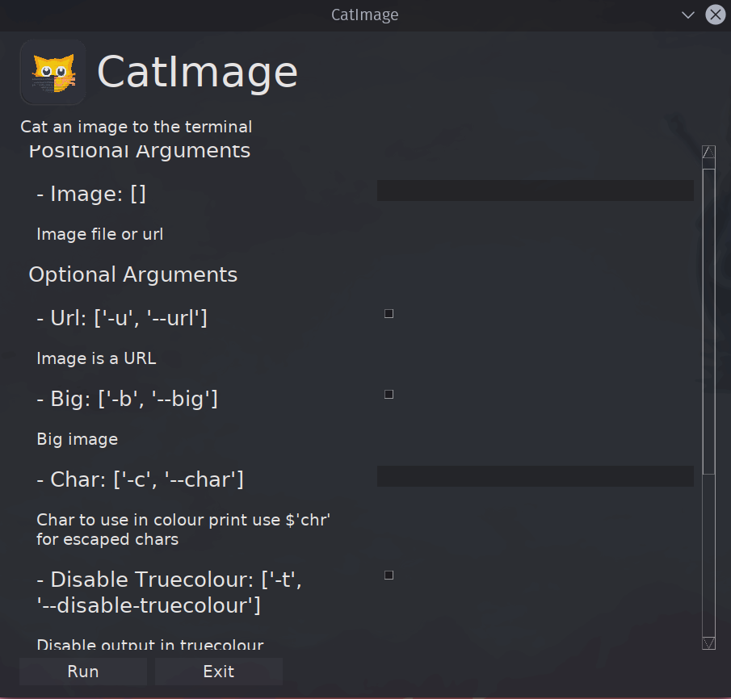
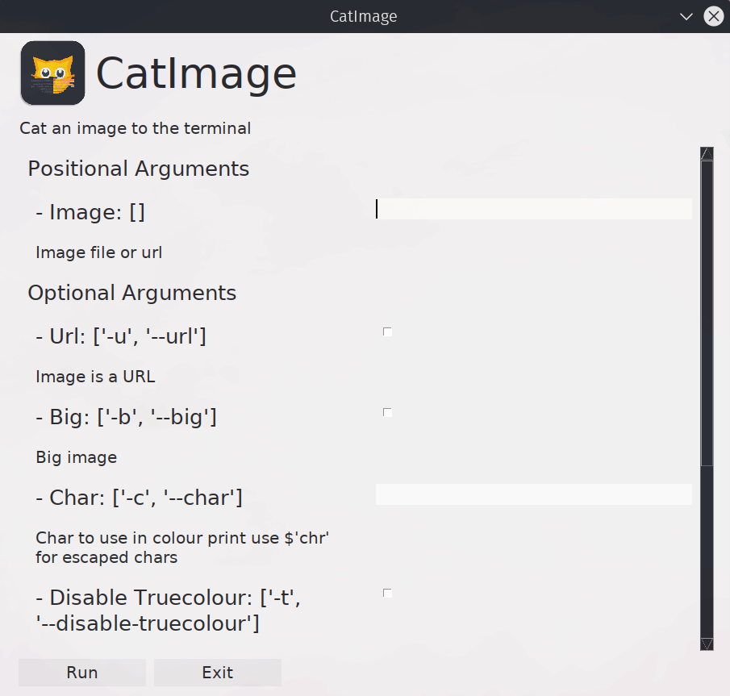
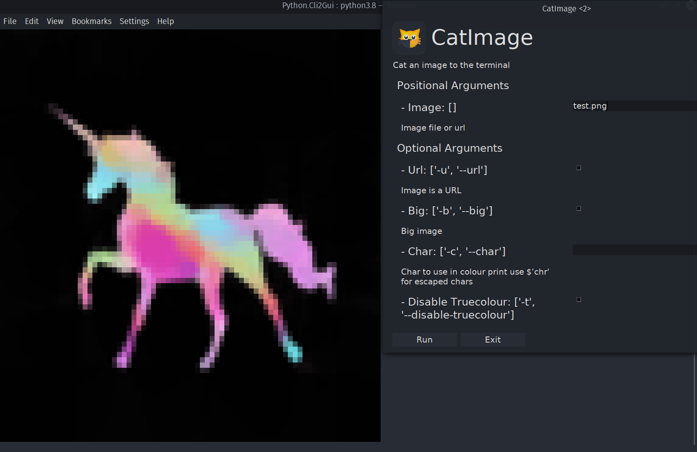
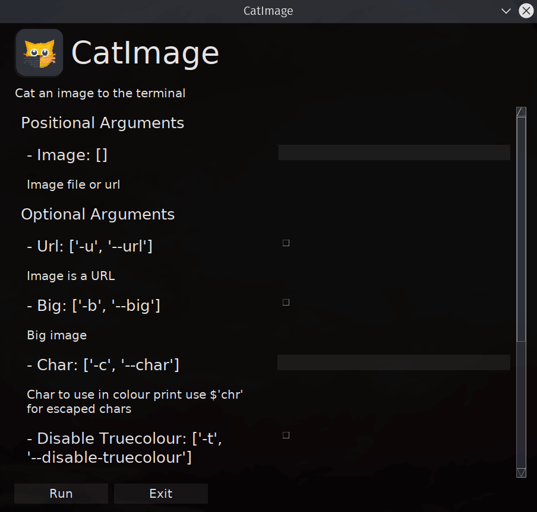

[](../../)
[](../../)
[](../../issues)
[](/LICENSE.md)
[](../../commits/master)
[](../../commits/master)
[](https://pypistats.org/packages/cli2gui)
[](https://pepy.tech/project/cli2gui)
[](https://pypi.org/project/cli2gui)

<!-- omit in toc -->
# Cli2Gui


Use this module to convert a CLI program to a GUI

- [Comparison to similar projects](#comparison-to-similar-projects)
	- [Parser Support](#parser-support)
	- [GUI Toolkit Support](#gui-toolkit-support)
	- [GUI Feature Support](#gui-feature-support)
- [Roadmap](#roadmap)
- [Decorator](#decorator)
- [Using the decorator in your project](#using-the-decorator-in-your-project)
	- [run_function (optional)](#run_function-optional)
	- [auto_enable (optional)](#auto_enable-optional)
	- [parser (optional)](#parser-optional)
	- [gui (optional)](#gui-optional)
	- [theme (optional)](#theme-optional)
	- [darkTheme (optional)](#darktheme-optional)
	- [sizes (optional)](#sizes-optional)
	- [image (optional)](#image-optional)
	- [program_name (optional)](#program_name-optional)
	- [program_description (optional)](#program_description-optional)
	- [max_args_shown (optional)](#max_args_shown-optional)
	- [menu (optional)](#menu-optional)
- [Click](#click)
	- [run_function (required)](#run_function-required)
	- [parser (not applicable)](#parser-not-applicable)
- [Data Structures](#data-structures)
- [Documentation](#documentation)
- [Install With PIP](#install-with-pip)
- [Language information](#language-information)
	- [Built for](#built-for)
- [Install Python on Windows](#install-python-on-windows)
	- [Chocolatey](#chocolatey)
	- [Windows - Python.org](#windows---pythonorg)
- [Install Python on Linux](#install-python-on-linux)
	- [Apt](#apt)
	- [Dnf](#dnf)
- [Install Python on MacOS](#install-python-on-macos)
	- [Homebrew](#homebrew)
	- [MacOS - Python.org](#macos---pythonorg)
- [How to run](#how-to-run)
	- [Windows](#windows)
	- [Linux/ MacOS](#linux-macos)
- [Download Project](#download-project)
	- [Clone](#clone)
		- [Using The Command Line](#using-the-command-line)
		- [Using GitHub Desktop](#using-github-desktop)
	- [Download Zip File](#download-zip-file)
- [Screenshots](#screenshots)
	- [Desktop](#desktop)
	- [Themes](#themes)
- [Community Files](#community-files)
	- [Licence](#licence)
	- [Changelog](#changelog)
	- [Code of Conduct](#code-of-conduct)
	- [Contributing](#contributing)
	- [Security](#security)
	- [Support](#support)
	- [Rationale](#rationale)

## Comparison to similar projects
Do let me know if any of these are incorrect. Some of the comparisons are
based off documentation/ the readme

### Parser Support
| Parser           | Cli2Gui              | Gooey              | Quick              |
| ---------------- | -------------------- | ------------------ | ------------------ |
| Argparse         | :heavy_check_mark:   | :heavy_check_mark: | :x:                |
| Optparse         | :heavy_check_mark:   | :x:                | :x:                |
| DocOpt           | :heavy_check_mark:   | :x:                | :x:                |
| Click            | :heavy_check_mark: * | :x:                | :heavy_check_mark: |
| GetOpt           | :heavy_check_mark:   | :x:                | :x:                |
| Dephell Argparse | :heavy_check_mark:   | :x:                | :x:                |

```none
* Partial support (use Click2Gui)

This works for simpler programs but sadly falls flat for more complex programs
```

### GUI Toolkit Support
| GUI Toolkits | Cli2Gui            | Gooey              | Quick              |
| ------------ | ------------------ | ------------------ | ------------------ |
| Tkinter      | :heavy_check_mark: | :x:                | :x:                |
| WxWidgets    | :x:                | :heavy_check_mark: | :x:                |
| Qt           | :heavy_check_mark: | :x:                | :heavy_check_mark: |
| Gtk          | :x:                | :x:                | :x:                |
| Web          | :heavy_check_mark: | :x:                | :x:                |

### GUI Feature Support
| Basic GUI                  | Cli2Gui            | Gooey              | Quick              |
| -------------------------- | ------------------ | ------------------ | ------------------ |
| Override name/ description | :heavy_check_mark: | :heavy_check_mark: | :x:                |
| Theming                    | :heavy_check_mark: | :warning: Limited  | :warning: Limited  |
| DarkMode                   | :heavy_check_mark: | :x:                | :heavy_check_mark: |
| Window Size                | :heavy_check_mark: | :heavy_check_mark: | :x:                |
| Element Size               | :heavy_check_mark: | :x:                | :x:                |
| Custom Images              | :heavy_check_mark: | :heavy_check_mark: | :x:                |

Cli2Gui is pretty lacking in these features and will probably remain that way
to ease maintainability - the primary aim is to support multiple argparse
libraries over fancy widgets

| Advanced GUI           | Cli2Gui            | Gooey              | Quick              |
| ---------------------- | ------------------ | ------------------ | ------------------ |
| Dropdown               | :heavy_check_mark: | :heavy_check_mark: | :heavy_check_mark: |
| Slider                 | :x:                | :heavy_check_mark: | :heavy_check_mark: |
| Tabs                   | :x:                | :heavy_check_mark: | :heavy_check_mark: |
| Menus                  | :heavy_check_mark: | :heavy_check_mark: | :x:                |
| Max Args before Scroll | :heavy_check_mark: | :x:                | :x:                |

## Roadmap
For completed components, see the changelog (link below)

| Feature     | Description                           | Status              |
| ----------- | ------------------------------------- | ------------------- |
| Python Fire | https://github.com/google/python-fire | Under consideration |

## Decorator

```python
@Cli2Gui(run_function, auto_enable=False, parser="argparse", gui="pysimplegui",
		theme="", darkTheme="", sizes="", image="", program_name="",
		program_description="", max_args_shown=5, **kwargs)
```

## Using the decorator in your project
### run_function (optional)
The name of the function to call eg. main(args). Defaults to None. If not
specified, program continues as normal (can only run once)

```python
def main(args):
	print(args.arg)

@Cli2Gui(run_function=main)
def cli():
	parser = argparse.ArgumentParser(description="this is an example parser")
	parser.add_argument("arg", type=str,
		help="positional arg")
	args = parser.parse_args()
	main(args)
```

### auto_enable (optional)
Enable the GUI by default. If enabled by default requires `--disable-cli2gui`, otherwise requires `--cli2gui`

```python
@Cli2Gui(auto_enable=False)
```

### parser (optional)
Override the parser to use, defaults to argparse. Current options are:
"argparse", "getopt", "optparse", "docopt", "dephell_argparse"

```python
@Cli2Gui(parser="argparse")
```

### gui (optional)
Override the gui to use. Current options are:
"pysimplegui", "pysimpleguiqt","pysimpleguiweb". Defaults to "pysimplegui".

pysimplegui is the recommended option

```python
@Cli2Gui(gui="pysimplegui")
```

### theme (optional)
Set a base24 theme. Can also pass a base24 scheme file. eg. `one-light.yaml`

```python
@Cli2Gui(theme=["#e7e7e9", "#dfdfe1", "#cacace", "#a0a1a7", "#696c77",
		"#383a42", "#202227", "#090a0b", "#ca1243", "#c18401", "#febb2a",
		"#50a14f", "#0184bc", "#4078f2", "#a626a4", "#986801", "#f0f0f1",
		"#fafafa", "#ec2258", "#f4a701", "#6db76c", "#01a7ef", "#709af5",
		"#d02fcd"])
```

### darkTheme (optional)
Set a base24 dark theme variant. Can also pass a base24 scheme file. eg.
`one-dark.yaml`

```python
@Cli2Gui(darkTheme=["#282c34", "#3f4451", "#4f5666", "#545862", "#9196a1",
		"#abb2bf", "#e6e6e6", "#ffffff", "#e06c75", "#d19a66", "#e5c07b",
		"#98c379", "#56b6c2", "#61afef", "#c678dd", "#be5046", "#21252b",
		"#181a1f", "#ff7b86", "#efb074", "#b1e18b", "#63d4e0", "#67cdff",
		"#e48bff"])
```

### sizes (optional)
Set the UI sizes such as the button size

```python
@Cli2Gui(sizes={
		"title_size": 28,
		"label_size": (30, None),
		"input_size": (30, 1),
		"button":(10, 1),
		"padding":(5, 10),
		"helpText_size": 14,
		"text_size": 11})
```

### image (optional)
Set the program icon. File extensions can be any that PIL supports

```python
@Cli2Gui(image="path/to/image.png")
```

### program_name (optional)
Override the program name

```python
@Cli2Gui(program_name="custom name")
```

### program_description (optional)
Override the program description

```python
@Cli2Gui(program_description="this is a custom description")
```

### max_args_shown (optional)
Maximum number of args shown before using a scrollbar

```python
@Cli2Gui(max_args_shown=5)
```

### menu (optional)
Add a menu to the program. Defaults to None. eg.

```python
THIS_DIR = str(Path(__file__).resolve().parent)
menu={"File": THIS_DIR + "/file.md"}
```

Works significantly better with pysimplegui than pysimpleguiqt

```python
@Cli2Gui(menu={"File": THIS_DIR + "/file.md", "Another File": THIS_DIR + "/another_file.md", })
```

## Click

```python
def Click2Gui(run_function, gui="pysimplegui", theme="", darkTheme="",
		sizes="", image="", program_name="", program_description="",
		max_args_shown=5, menu="", **kwargs):
```

Very similar to the decorator but with the following differences...

### run_function (required)
Specify the click function to use. (attempts were made to offer full program
support however this behaved very poorly)

### parser (not applicable)
As this is exclusively for click, this option is not present

## Data Structures
See the [DATA_STRUCTURES](/DATA_STRUCTURES.md) for more information.

## Documentation
See the [Docs](/DOCS/) for more information.

## Install With PIP

```python
pip install cli2gui
```

Head to https://pypi.org/project/cli2gui/ for more info

## Language information

### Built for
This program has been written for Python versions 3.7 - 3.10 and has been tested with both 3.7 and
3.10

## Install Python on Windows

### Chocolatey

```powershell
choco install python
```

### Windows - Python.org
To install Python, go to https://www.python.org/downloads/windows/ and download the latest
version.

## Install Python on Linux

### Apt

```bash
sudo apt install python3.x
```

### Dnf

```bash
sudo dnf install python3.x
```

## Install Python on MacOS

### Homebrew

```bash
brew install python@3.x
```

### MacOS - Python.org
To install Python, go to https://www.python.org/downloads/macos/ and download the latest
version.

## How to run

### Windows

- Module
	`py -3.x -m [module]` or `[module]` (if module installs a script)

- File
	`py -3.x [file]` or `./[file]`

### Linux/ MacOS

- Module
	`python3.x -m [module]` or `[module]` (if module installs a script)

- File
	`python3.x [file]` or `./[file]`

## Download Project

### Clone

#### Using The Command Line

1. Press the Clone or download button in the top right
2. Copy the URL (link)
3. Open the command line and change directory to where you wish to
clone to
4. Type 'git clone' followed by URL in step 2

	```bash
	git clone https://github.com/FHPythonUtils/Cli2Gui
	```

More information can be found at
https://help.github.com/en/articles/cloning-a-repository

#### Using GitHub Desktop

1. Press the Clone or download button in the top right
2. Click open in desktop
3. Choose the path for where you want and click Clone

More information can be found at
https://help.github.com/en/desktop/contributing-to-projects/cloning-a-repository-from-github-to-github-desktop

### Download Zip File

1. Download this GitHub repository
2. Extract the zip archive
3. Copy/ move to the desired location

## Screenshots

### Desktop
<div>



</div>

### Themes

|                                       Light                                        |                                        Dark                                        |                                       Black                                        |
| :--------------------------------------------------------------------------------: | :--------------------------------------------------------------------------------: | :--------------------------------------------------------------------------------: |
|  |  |  |

## Community Files

### Licence
MIT License
Copyright (c) FredHappyface
(See the [LICENSE](/LICENSE.md) for more information.)

### Changelog
See the [Changelog](/CHANGELOG.md) for more information.

### Code of Conduct
Online communities include people from many backgrounds. The *Project*
contributors are committed to providing a friendly, safe and welcoming
environment for all. Please see the
[Code of Conduct](https://github.com/FHPythonUtils/.github/blob/master/CODE_OF_CONDUCT.md)
 for more information.

### Contributing
Contributions are welcome, please see the
[Contributing Guidelines](https://github.com/FHPythonUtils/.github/blob/master/CONTRIBUTING.md)
for more information.

### Security
Thank you for improving the security of the project, please see the
[Security Policy](https://github.com/FHPythonUtils/.github/blob/master/SECURITY.md)
for more information.

### Support
Thank you for using this project, I hope it is of use to you. Please be aware that
those involved with the project often do so for fun along with other commitments
(such as work, family, etc). Please see the
[Support Policy](https://github.com/FHPythonUtils/.github/blob/master/SUPPORT.md)
for more information.

### Rationale
The rationale acts as a guide to various processes regarding projects such as
the versioning scheme and the programming styles used. Please see the
[Rationale](https://github.com/FHPythonUtils/.github/blob/master/RATIONALE.md)
for more information.
